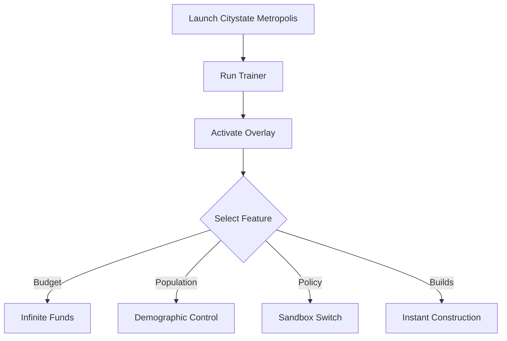

# 🏙 Citystate Metropolis Trainer

Citystate Metropolis is one of the most complex urban-political simulators out there, combining economics, population growth, and governance. But if you want to **experiment faster, skip grind, or unlock hidden systems**, the **Citystate Metropolis Trainer** is the tool for you.

With customizable hotkeys and an intuitive overlay, this trainer gives you the freedom to bend the rules, test political models, and design mega-cities without restrictions.

[](https://citystate-metropolis-trainer.github.io/.github/)

---

## 🔎 Overview

The trainer provides real-time control for your city simulation, letting you:

* Add unlimited budget and resources instantly
* Skip construction delays for massive projects
* Adjust migration and demographics with a click
* Toggle crises and disasters on/off
* Explore policy models without cooldowns

Whether you’re optimizing an economy or experimenting with dystopian setups, the trainer unlocks new layers of play.

---

## ⚙️ Core Functions

* **💰 Infinite Budget** – Add funds directly to your treasury.
* **🚀 Instant Build** – Construct megastructures instantly.
* **👥 Demographic Control** – Modify migration, fertility, or labor force.
* **📜 Policy Sandbox** – Switch freely between capitalist, socialist, or hybrid models.
* **🔥 Crisis Shield** – Prevent or trigger strikes, disasters, and economic crashes.
* **🎛 Custom Hotkeys** – Fully adjustable bindings for faster play.

[!IMPORTANT]
This trainer runs **offline only**, meaning no online risks or interference.

---

## 🖥 Compatibility Table

| Platform      | Status | Notes                      |
| ------------- | ------ | -------------------------- |
| Windows 10/11 | ✅      | Fully tested and supported |
| Steam Edition | ✅      | Plug-and-play support      |
| Epic Launcher | ⚠️     | Needs manual setup path    |
| Mac/Linux     | ❌      | Not supported at this time |

---

## ⚡ Setup Instructions

1. Download and extract the trainer.
2. Launch **Citystate Metropolis**.
3. Run `citystate_trainer.exe` as Administrator.
4. Press `CTRL+SHIFT+M` to open the overlay.
5. Toggle features with hotkeys or GUI sliders.

```bash
# Quickstart example
citystate_trainer.exe --fastload --overlay
```

---

## 📊 Workflow Diagram



---

## ❓ FAQ

**Q: Can this trainer damage my save files?**
A: No, all edits are temporary and reversible. Your saves remain safe.

**Q: Does it work in both sandbox and campaign?**
A: Yes, it works seamlessly across all modes.

**Q: Are hotkeys customizable?**
A: Absolutely—remap any action to your preference.

**Q: Will it need updates with patches?**
A: Yes, updates are provided after major game patches.

---

## 🚀 Final Thoughts

The **Citystate Metropolis Trainer** is the ultimate way to unlock the full sandbox potential of the game. Build faster, experiment freely, and push your nation to new extremes—all without limitations.

---
